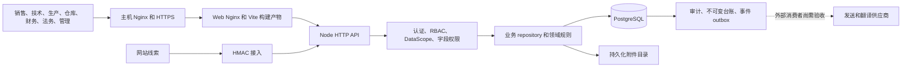

# PROJECT TAKEOVER REPORT

日期：2026-10-08，Asia/Singapore。调查对象：`ivanzhao299/kingturf-bessiness-os`，代码基线 `9d89c7d6739454345b1397fe6b02c945fbe1cb99`。

本项目已有较完整的经营、制造、履约和证据管理实现，生产服务当前可达。当前仍不能认定具备稳定交付条件：完整本地质量门禁失败，文档提供的 API 启动路径不可用，发布治理存在缺口，认证和聚合查询存在需要优先修复或进一步验证的权限风险。

本轮完成只读代码调查、本地隔离验证、GitHub 设置查询及生产公共端点读取。没有修改业务代码、依赖版本、历史迁移、生产配置或生产数据，没有部署、发送消息、推送或改变 GitHub 设置。仓库写入范围仅为接管报告和持续状态文档；本地测试创建了忽略目录、构建输出及专用临时 PostgreSQL。

## A. Repository Summary

仓库共 331 个原有已跟踪文件，pnpm monorepo 包含 2 个应用和 6 个共享包。仓库内未找到 AGENTS.md 或 CONTRIBUTING；执行本次用户提供的 AGENTS 指令。README、ADR、产品计划、历史验收和运维文档均已建立，但部分当前状态陈述已过期。

```text
apps/api                 Node HTTP API、权限策略、业务 repositories、19 个测试文件
apps/web                 原生 TypeScript/DOM 工作台、Vite、8 个测试文件
packages/config          环境校验、共享 TypeScript 配置
packages/database        pg、事务、迁移 CLI、70 个有序 SQL 迁移
packages/domain          独立业务规则和错误类型
packages/types           DTO、权限和公共类型
packages/ui              现有 UI 基础能力
packages/testing         测试辅助
tests/e2e                登录、路由、成本、证据、文档、P1、生产只读及岗位验收
infra/docker             本地及生产 Compose、API/Web 镜像、容器 Nginx
infra/nginx              正式域名入口配置
.github/workflows        CI 和手动生产发布
scripts                  演示 seed/验证、权限清单、PDF/模板、HTTPS、发布资源保留
docs/adr                 10 个架构决策
docs/engineering         产品、角色、权限、回归和设计规范
docs/tasks               任务规格与长期路线
docs/evidence            历史验收与本次证据
docs/agent-memory        项目状态、决策、交接和执行基线
```

根 package.json 定义 install、lint、typecheck、test、build、format、security、数据库、演示及 E2E 路线。`ci:local` 是完整且有顺序的门禁，包含数据库写操作，因此只能指向明确可丢弃的本地测试库。没有独立的根级 smoke 或 verify 总脚本；测试脚本混合执行单元和 PostgreSQL 集成测试。

## B. Architecture

| 层面           | 当前事实                                                                                                     |
| -------------- | ------------------------------------------------------------------------------------------------------------ |
| 运行时与包管理 | Node 24；本机 24.19.0，CI 24.13.0；pnpm 10.33.4；锁文件存在                                                  |
| 前端           | 原生 TypeScript、DOM、hash 路由、Vite 7.3.6；没有 React/Vue；已有 UI 包和 CSS 体系                           |
| 后端/API/BFF   | Node 原生 HTTP；`server.ts` 负责网络与装配，`app.ts` 负责 dispatch、权限、DTO；没有独立 BFF 服务             |
| 数据           | PostgreSQL 17.7、pg 8.22.0、手写参数化 SQL、显式事务；没有 ORM 或自动同步 schema                             |
| 身份           | scrypt 密码、随机 opaque bearer token、存储 token hash、每请求复核身份与岗位状态                             |
| 授权           | 默认拒绝 RBAC + DataScope + 字段白名单；原子角色与职责分离约束                                               |
| 事件/MQ        | PostgreSQL transactional outbox、租约/重试/死信基础；未配置独立 Redis/RabbitMQ/Kafka                         |
| 缓存           | 前端请求合并/状态缓存；未发现独立服务端缓存服务                                                              |
| 文件           | 本地持久化附件 adapter，生产挂载 `/var/lib/kingturf/attachments`；不是对象存储                               |
| 外部集成       | 网站线索 HMAC 验证及幂等；受控文档渠道注册、翻译和发送 outbox；生产渠道消费者/回执需要独立验收               |
| 日志/监控      | correlation ID、结构化 telemetry、业务审计、health/ready/version、容器日志轮转；未确认外部告警和真实用户监测 |
| 部署           | GitHub Actions → SSH/rsync → 生产三服务 Compose → 主机 Nginx/TLS；共享主机上的独立项目资源                   |



架构事实依据：`docs/adr/0001..0010`、`apps/api/src/server.ts`、各 workspace manifest、Compose。维护性热点为 `apps/web/src/bootstrap.ts` 的 16,062 行与 `apps/api/src/app.ts` 的 6,720 行；文件体量本身不构成立即重写理由。

### 项目运行方式

README 要求 Node 24、pnpm 10.33.4、Docker Compose，复制 `.env.example` 后启动 PostgreSQL、迁移并执行 `pnpm dev`。本次验证发现三个断点：

1. `apps/api/package.json:13` 使用 strip-only 模式，但 `packages/domain/src/index.ts:23` 等代码包含 constructor parameter properties，开发启动出现 `ERR_UNSUPPORTED_TYPESCRIPT_SYNTAX`。
2. `pnpm build` 后 `pnpm --filter @kingturf/api start` 也出现相同错误。domain/database/types 的运行时 exports 指向 `.ts` 源码，所以 API 编译成功并不保证普通 Node 可启动。
3. `apps/web/vite.config.ts:3` 没有 API proxy，而浏览器使用同源 `/api/v1/...`。本地 preview 请求 `/api/v1/auth/session` 和 `/health` 均返回 200 HTML，业务请求没有到 API。生产容器 Nginx 有正确代理，因此不能把本地缺陷直接推断为当前生产故障。

另外，API 命令没有加载 `.env` 的参数或 dotenv；README 的复制操作不能自动把变量送入 API 子进程。应明确环境注入方式，并建立真实启动 smoke。

生产 API 镜像使用 `--experimental-transform-types` 执行源码。本轮以同样模式、仅指向隔离测试库启动 API，health/ready/version/未登录拒绝通过。没有构建生产镜像或启动生产 Compose。

## C. Current Git State

| 项目          | 调查结果                                                                                               |
| ------------- | ------------------------------------------------------------------------------------------------------ |
| Repository    | `git@github.com:ivanzhao299/kingturf-bessiness-os.git`；GitHub 返回 public、未 archived                |
| 默认/起始分支 | `main`                                                                                                 |
| 起始 HEAD     | `9d89c7d6739454345b1397fe6b02c945fbe1cb99`                                                             |
| 远端实时确认  | `git ls-remote` 的 HEAD/main 均与起始 HEAD 一致                                                        |
| 起始工作区    | 没有未提交修改，没有未跟踪文件                                                                         |
| 报告分支      | `codex/project-takeover-baseline`；业务源文件未修改                                                    |
| Tags/Releases | 本地 tag 和远端 tag 查询为空；GitHub releases 查询为空。发布使用不可变 commit SHA                      |
| 最近主要提交  | #30 路由/异步隔离；#29 文档受阻引导；#28 品牌与发送；#26 登录懒加载；#25 产品/存储审计；#24 成本工作台 |

2026-09-06 的 HEAD 对应 GitHub CI run `33996298518` 和生产发布 run `33996421402`，历史结果均 success。这些结果发生在日期依赖失效前，不能替代本次测试结果。

## D. Development Baseline

`CURRENT_BASELINE` 针对原始代码 SHA；文档 checkpoint 不改变该代码基线。机器初始无 node_modules、无 `.env`、无环境 DATABASE_URL。

| 检查                      | 状态 | 证据及解释                                                          |
| ------------------------- | ---- | ------------------------------------------------------------------- |
| install                   | PASS | `pnpm install --frozen-lockfile`；8 workspace + 根；锁文件未变化    |
| format                    | PASS | `pnpm format:check`；原始树无格式错误                               |
| frontend manifest         | PASS | 118 个直接能力、19 个受控端点族                                     |
| lint                      | PASS | `pnpm lint`；8 个 workspace，0 错误                                 |
| typecheck                 | PASS | `pnpm typecheck`；8 个 workspace，0 错误                            |
| security dependency audit | PASS | `pnpm security:check`，未报告已知生产依赖漏洞；不是应用安全通过证明 |
| documented API dev/start  | FAIL | 两条路径均触发 TypeScript parameter property/strip-only 不兼容      |
| local Web/API connection  | FAIL | Vite preview 同源 API 请求返回 HTML；配置没有代理                   |
| ci:local                  | FAIL | 测试阶段遇 Web 失败并停止，之后没有执行 API 测试/该轮 build/audit   |

完整 CI 的后续工作未被跳过伪装为通过：API tests、build、dependency audit 分别独立执行并单独记录结果。

## E. Test Baseline

专用 PostgreSQL 使用仓库 CI 相同镜像 `postgres:17.7-alpine3.23`、UTC、随机 loopback 端口、tmpfs 数据目录和独立测试库。没有复用任何既有数据库或卷。数据库写操作仅限这个 fixture；集成测试创建并清理随机 schema。

| Workspace | 通过 | 失败 | 结论                                                    |
| --------- | ---: | ---: | ------------------------------------------------------- |
| config    |    4 |    0 | PASS                                                    |
| database  |   61 |    0 | PASS，含 49 个迁移/安全静态测试和 12 个 PostgreSQL 测试 |
| testing   |    1 |    0 | PASS                                                    |
| types     |    1 |    0 | PASS                                                    |
| ui        |    1 |    0 | PASS                                                    |
| domain    |   14 |    0 | PASS                                                    |
| web       |  104 |    1 | FAIL                                                    |
| api       |  138 |    1 | FAIL；ci:local 中未到达，另以 package 自带 test 执行    |
| 合计      |  324 |    2 | 326 个不同测试，非重复运行累计                          |

按测试文件类型归类：单元/API dispatch 262/263 通过，真实 PostgreSQL 集成 62/63 通过。不是仅 mock 的测试体系：CRM、权限、商业、QTC、制造、催收、投诉和线索接入都有真实数据库证据。

### 两个确定失败

| 失败           | 首个错误与根因                                                                                                                                                                 | 历史性/上线影响                                                                       |
| -------------- | ------------------------------------------------------------------------------------------------------------------------------------------------------------------------------ | ------------------------------------------------------------------------------------- |
| Web 商机工作台 | `bootstrap.test.ts:1593` 的商机日期固定为 2026-10-01；现在已过期，`bootstrap.ts:3020` 执行 `card.classList.add`，测试 `RenderedElement` 在 :634 未实现 classList；抛 TypeError | 随日期失效的历史测试；阻塞当前 CI，未证明真实浏览器逾期卡片有相同故障                 |
| CAPA 独立核验  | `complaint-postgres.integration.test.ts:264` 插入 target_at=2026-09-30，违反 `0055...sql:13` 的 `target_at>created_at`；还存在固定 action due_at 和验证日期                    | 日期夹具过期；阻塞 CI，独立核验和动作完成路径本次没有成功跑完；不能移除正确数据库约束 |

两个失败均已单独定向复现。修复方向是显式时钟/相对日期和真实 DOM 语义，不是延长到另一个硬编码年份、删除断言、skip 或修改历史约束。

### E2E

- 原始 Chrome 配置：FAIL/BLOCKED。机器无 `/opt/google/chrome/chrome`，安装需要不可用的 sudo 身份；5 个启动用例均未进入业务断言。
- 本地 Chromium 补充验证：PASS，21/21，覆盖 6 个文件的成本矩阵、文档发送、登录、订单证据、启动、路由隔离。只在忽略目录增加 runner 配置，将 browser channel 改为 Chromium；没有修改用例和断言。缺少的共享库下载后解包到私有临时目录，没有变更系统软件包。
- 本轮检查登录桌面及文档配置移动端截图，未见这两处明显裁切；21 个用例包含键盘、异步竞态、错误重试和移动布局检查。
- 这些浏览器场景多数 route.fulfill 模拟业务接口，证明界面交互，不证明 UI→真实 API→数据库的完整商业链。
- P1 demo、真实多岗位链路和生产认证 UAT：NOT RUN，没有可用的专用账号/完整夹具。本轮没有临时生产 provisioning。生产 role UAT 源码在未配置账号时会 skip，不能将其计为验收通过。

CI 当前不执行 Playwright、浏览器业务 smoke 或 role UAT。若直接执行根 `pnpm test` 而没有 DATABASE_URL，会在 database suite fail-fast；这项环境阻塞与上述两个实际测试失败分别记录。

## F. Build Baseline

`pnpm build`：PASS，8/8 workspace。前端登录关键路径 gzip JS 11,179 bytes、CSS 1,898 bytes；工作台 JS gzip 约 115.59 KB、CSS 约 17.01 KB，已延迟加载。构建检查不是运行验收。

| Smoke                                  | 结果                                                                                           |
| -------------------------------------- | ---------------------------------------------------------------------------------------------- |
| 本地 API，按 Docker transform 模式启动 | PASS：health 200/ok、ready 200/ready、version 精确匹配基线 SHA、未登录 customers 401           |
| README 构建产物启动                    | FAIL：运行时仍加载不兼容的 `.ts` workspace exports                                             |
| Vite 前后端业务连接                    | FAIL：API URL 返回 HTML                                                                        |
| 生产只读 health/ready/version          | PASS：200/ok、200/ready；SHA=`9d89c7d6739454345b1397fe6b02c945fbe1cb99`；builtAt=`33996421402` |
| Docker build、生产部署、受保护业务 UAT | NOT RUN                                                                                        |

线上运行正常与本地启动失败可以同时成立：两条运行路径不同。

## G. Product / Business Gaps

`PRODUCT_GAP_REPORT`：系统服务人造草坪制造和外贸的经营全链，主要用户为销售/外贸、技术、成本、采购、计划、车间、质量、仓库、财务、法务和管理者。终局目标是一笔真实订单不依赖外部 Excel，贯穿交付、回款、佣金及利润，并保留完整审批与证据。

| 核心链路                         | UI/API/service/DB/permission/audit 现状                                                  | 当前证据和缺口                                                                                         |
| -------------------------------- | ---------------------------------------------------------------------------------------- | ------------------------------------------------------------------------------------------------------ |
| 线索→客户→商机→CTR               | Web 工作台→app dispatch→CRM/commercial repositories→租户关系、版本/审计；网站入口有 HMAC | CRM PostgreSQL 10/10；未完成本次浏览器创建/修改/转化/归档全链                                          |
| 方案→成本→政策→报价              | 规格版本、成本快照、字段表单、审批/签发门禁及审计                                        | commercial PostgreSQL 2/2、成本浏览器场景通过；采购映射、价格有效期、规格单位及高量数据需真实岗位验收  |
| 报价→信用→合同→订单              | 固定报价/信用/签署证据、不可变 QTC graph、服务端约束                                     | QTC PostgreSQL 2/2；岗位交接与拒绝路径的浏览器真实账号证据待补                                         |
| 订单→应收→付款→核销→佣金         | 不可变财务/佣金台账、幂等和审计；Order 360 聚合                                          | 财务相关集成通过；Order 360 来源数据权限存在缺口；不能以展示金额认定财务闭环                           |
| BOM→采购→收货→MRP→工单→领料/报工 | 制造/采购/MRP/production repositories，库存台账、冻结版本、批次                          | production PostgreSQL 1/1 通过；本次没有全流程浏览器/扫码/大数据量验收                                 |
| 质量→实际成本→发货门禁→物流→POD  | 检验/放行、成本独立审批、发货例外、不可变事件                                            | 源码和历史 L16–L18 验收存在；当前独立岗位真实订单未重验                                                |
| 逾期→催收→法务→证据包            | collections repository、独立受理与不可变证据 manifest                                    | collection PostgreSQL 1/1；法务嵌套字段可见性与独立权限边界不一致                                      |
| 投诉→NCR→CAPA→独立验证→关闭      | 状态机、职责分离、批次关系、审计；已存在 L20 实现                                        | complaint PostgreSQL 3/4；日期夹具阻断独立验证，历史“L20 active”不等于代码缺失，也不能认定生产完成     |
| 受控文档→审批/翻译→发送→回执     | 文档版本、渠道配置、幂等 dispatch、outbox、审计和 UI 状态                                | 7 个发送 UI 场景通过；`dispatch` 入队没有证明真实发送，server 未装配供应商消费循环；逐渠道回执闭环待证 |

本轮沿模块边界抽查，不声称逐页、逐命令和每个历史状态均已验收。真实 CRUD、异常、删除/归档、独立审批、权限反向和业务审计需要按链路逐批补齐。HTTP 200、历史验收、mock E2E 与生产真实业务分别记录。

UX 优先项是跨岗位待办/关联对象深链接、明确阻断原因、服务端分页及类型化筛选、规格/单位字典、批次与投诉双向追溯。复用现有 UI，不新增框架。现有冷启动、操作进度、错误重试、发送排队提示、按权限隐藏操作及局部刷新已有测试支持，应保留。

TODO/mock/placeholder 初查：在 apps/api/src、apps/web/src 的非测试业务代码搜索 TODO、FIXME、mock、hardcoded、debug、bypass 等，未找到明确生产 mock-auth/debug bypass；这是关键词扫描结论，不是安全证明。正常表单 placeholder、测试 mock、权限不足空状态和受控模板不应当作假业务。演示 seed 使用固定样本且会真实写入配置目标，未经目标校验不应执行；本轮未执行。P4/P5 属路线规划，不能因蓝图出现就标记实现。

文档漂移：MASTER_DEVELOPMENT_PLAN 的初始审计仍称 P2/P3 未实现，而同文件后文及近期审计已记录制造、交付和催收能力；canonical memory 更新至 2026-08-26，代码已到 2026-09-06。保留旧验收，不重新推翻；从本次状态链接继续，未取得新生产 UAT 前不关闭或重开历史里程碑。

## H. Security Risks

1. **密码变更 P1**：`app.ts:2916` 只接受新密码；`security.ts:147` 不验证当前密码，`repositories.ts:409` 不撤销已有 sessions。管理员重新配置身份也不撤销 sessions。被盗会话在密码更换后可能继续使用。改密和成功 audit 不在同一事务，审计失败可能留下已变更密码却返回 500 的状态。静态路径由独立 reviewer 复核；未在生产利用。
2. **Order 360 来源权限 P1 待动态完整验证**：`app.ts:2856` 使用整单范围，但 :2887 对相关模块仅按 capability 和顶层字段过滤，不传各自 scopes/anchors。repository :37 的聚合以订单上下文取相关资料，可能让同租户宽订单权限读取窄财务/佣金范围。跨租户隔离已有控制，此问题不能误称跨租户漏洞。
3. **法务嵌套边界 P1 待政策确认**：只有 collection:read、无 legal-case:read，仍可获取嵌套法务移交/包 manifest；订单时间线却隐藏法务事件。`order-360-repositories.ts:53`、`collection-repositories.ts:62`、`app.ts:57,2887` 支持该结论。独立 reviewer 复核，主代理用合成 dispatch 复现。manifest 是来源类型/ID 和缺项清单，不是原始证据正文；真实权限预期需依据角色规范确认；按结果修复或记录预期，并覆盖两个入口。
4. **风险推导 P2**：Order 360 无来源能力校验就返回 LOW_MARGIN、OPEN_AR、CREDIT_EXPIRED 三个布尔推导；合成 dispatch 已复现，无报价权限也能看到低毛利推导。没有证明泄露精确金额。
5. **登录保护 P1 待外部配置核实**：应用和仓库 Nginx 未见限速/锁定；上游 WAF/全局 Nginx 不在本次读取范围。UI 的 429 文案不证明服务端防护存在。

正向控制包括 scrypt、不可逆 token hash、每请求身份状态/会员检查、服务端默认拒绝、租户 SQL 谓词、复合外键和职责分离数据库约束；网站 HMAC 使用时效和 timingSafeEqual。附件授权、SQL/XSS/CSRF 与所有 IDOR 面尚需逐路由专项验证。文档 HTML 有 sanitize/escape 路径，但未执行完整渗透测试。仅扫描文件名发现提交的环境文件为 `.env.example`，未读取真实密钥文件；没有完成 Git 全历史 secrets 扫描。

## I. Database Risks

70 个迁移在空白测试库应用成功；再次 migrate 成功，记录 70 项且无缺失 checksum。database 61/61 通过，涵盖租户、职责分离、不可变证据和迁移完整性。没有 ORM entities 自动同步；schema 与手写查询的兼容性通过集成测试验证，失败 CAPA 路径除外。

- `migrationStatus` 在 `packages/database/src/index.ts:101` 执行 CREATE/ALTER，`db:status` 不是严格只读工具；生产只读检查不能直接使用它。
- `server.ts:52` 在每次 API 启动自动 migrate；`index.ts:124` 没有迁移协调锁。扩容/并发重启可能竞争，尚未动态复现。同一 API 启动进程和连接执行迁移；生产数据库角色实际授权尚未核验。
- 迁移逐文件事务且校验历史 checksum，是已有保障；发布没有独立 schema 状态预检、显式迁移门禁或应用回滚与 schema 兼容验证。
- 多个新增 CHECK 为 NOT VALID，保护新增/更新记录，不证明历史记录全部满足约束；例如 0055 的 CAPA/投诉约束。不能直接 VALIDATE 或修历史生产数据，应先只读计数和影响分析。
- 多表有租户复合键、FK、索引、timestamptz、版本与软删除；不可变台账使用追加事件，不能把没有软删除视为缺陷。没有对生产索引、慢查询、孤儿记录、约束校验状态或全部数据库模型做实际盘点。
- 静态源码未找到 RLS；隔离主要靠应用谓词和数据库约束。这是架构事实，不是单独漏洞。

生产迁移状态、实际 schema 与数据一致性、备份内容和恢复能力尚未核验；本轮没有生产数据库连接或 schema 写操作。

## J. CI/CD Risks

标准 CI 有临时 PostgreSQL、冻结依赖、format、前端能力清单、测试目标 guard、迁移/状态、lint、typecheck、test、build、生产依赖 audit。生产 verify job 只执行 install/lint/typecheck/test/build，未复用完整 ci:local，漏掉 format/能力清单/目标 guard/audit，并使用不同 PostgreSQL 标签和 Node 版本口径。

**发布输入与来源**：`.github/workflows/deploy-production.yml:6` 只有 40 字符 SHA 描述，没有严格格式/main 归属检查；:95、:100、:118、:122 把原始输入拼入 shell。拥有 workflow dispatch 权限者可输入非预期 ref/字符串；存在命令拼接和非 main 发布风险。未构造或执行生产注入。

**GitHub 设置已实时查询**：main `protected=false`；仓库 rulesets=[]；main effective rules=[]；production environment 的 protection_rules=[]、deployment_branch_policy=null。这说明当前没有查询到的分支/环境审批约束，不能将 environment 名称当作审批存在的证据。本轮没有更改设置。

**发布互斥和恢复**：workflow 没有 concurrency；手动发布可能交错。恢复点是在 rsync 前生成的 custom pg_dump 和 metadata，仅校验非空；写入 website ingest 配置发生在备份前。成功后只保留最新 dump，失败不清理；附件备份/异地留存/恢复演练没有本次证据，runbook :30 也明确不构成完整灾备。

**生产运行前置与回滚**：runbook 要求检查 `/data` 挂载，但 workflow 无对应 fail-closed 前置。`.release-sha` 在健康检查前更新；失败后 marker 不能单独证明实际版本。健康/就绪/精确 SHA、本机 TLS 和主机公网检查已有；GitHub 跨境探针是 advisory。应用回滚按旧 SHA 重新发布、保留 additive migration，尚未验证完整数据库/附件联合恢复。生产 Dockerfile 仍使用源码及 experimental transform，并非本地编译产物启动路径。

## K. Project Issue Matrix

没有确认正在发生的 P0 事故。P1 问题按生产安全、认证/权限、质量与业务价值排序；“待证”表示不能冒充已确认生产漏洞或故障。

| ID     | 模块/类型         | 严重程度      | 是否阻塞       | 根因/事实                                                  | 修复方向                                                     |
| ------ | ----------------- | ------------- | -------------- | ---------------------------------------------------------- | ------------------------------------------------------------ |
| KT-001 | 发布/安全         | P1            | 安全发布       | 原始 SHA 输入进 shell，无格式/main 检查                    | 提前严格校验、解析不可变 SHA、安全传参                       |
| KT-002 | GitHub 治理       | P1            | 治理发布       | main 无 protection/rules；production 无审批/分支策略       | 明确发布责任人后设置保护与 required checks；外部变更单独记录 |
| KT-003 | 发布/并发         | P1            | 安全发布       | 无 concurrency、挂载前置和显式 schema 门禁                 | 发布串行、不取消进行中的发布；增加 preflight                 |
| KT-004 | 灾备/数据         | P1 待证       | 恢复 SLA       | 仅部署 dump，没有附件/异地/restore 证据                    | 隔离联合恢复演练，验证现有外部备份，再定义 RPO/RTO           |
| KT-005 | 身份/安全         | P1            | 认证验收       | 改密不重认证、不撤销 session；变更和审计非原子             | 保持接口兼容策略，补原子写/会话失效/错误与并发测试           |
| KT-006 | 聚合/API 数据权限 | P1 待证       | 权限验收       | 各来源 scopes/anchors 未贯穿 Order 360                     | 真实多角色反向用例，服务器逐来源裁剪                         |
| KT-007 | 催收/法务权限     | P1 待政策确认 | 权限验收       | 仅 collection:read 即可见法务 manifest；独立权限预期待确认 | 核对规范，独立受权嵌套序列化；覆盖两个入口                   |
| KT-008 | 认证/防滥用       | P1 待外部核实 | 安全 SLA       | 应用/仓库 ingress 没有登录限速                             | 先读取上游配置，再确定一致的限速/失败策略                    |
| KT-009 | Web 测试          | P1            | CI             | 固定日期和不完整 DOM 替身                                  | 实现必要 DOM 语义，固定时钟并覆盖过期/未过期                 |
| KT-010 | API/数据库测试    | P1            | CI             | CAPA 夹具日期已过期                                        | 相对数据库时钟建立有效顺序，保留反向断言                     |
| KT-011 | 本地运行/后端     | P1            | 开发与产物验收 | strip 模式与 TS 语法、source exports 不匹配                | 单独修 dev/start 路线；验证与生产路径兼容                    |
| KT-012 | 本地运行/前端     | P1            | 本地业务       | 无 API proxy、API 未加载 .env                              | 明确环境注入和同源代理，真实网络 smoke                       |
| KT-013 | 迁移/运维权限     | P1            | 安全运维       | status 执行 DDL，启动自动 migrate，无迁移锁                | 只读状态查询、并发协调和显式迁移规划；不改历史 SQL           |
| KT-014 | 测试/CI           | P2            | 业务验收       | CI 无 E2E，role UAT 可静默 skip；发布门禁不一致            | 本地无生产写入的 browser gate、缺夹具显式未验收              |
| KT-015 | 文档/外部集成     | P1 待验收     | 实际送达       | dispatch/outbox 不证明消费者和回执                         | 逐渠道实现/核验消费、幂等重试、状态和供应商证据              |
| KT-016 | UX/性能           | P2            | 高量使用待证   | 部分全量加载/DOM 文本筛选、岗位交接不足                    | 单模块服务端分页、类型化条件、待办/深链接                    |
| KT-017 | 数据历史完整性    | P2 待证       | 历史数据验收   | NOT VALID 约束不证明旧行有效                               | 只读盘点后制定增量处理方案                                   |
| KT-018 | 文档/治理债       | P2            | 下一阶段判断   | 历史当前状态与新代码有时间差                               | 保留历史，链接本次事实和 NEXT，不重写历史结论                |
| KT-019 | 架构/维护债       | P2            | 非即时阻塞     | 大型 app/bootstrap、重复 UI/范围 helper                    | 有回归后按路由/垂直链小步拆分，不无边界重构                  |
| KT-020 | 聚合/字段推导     | P2            | 字段权限验收   | 无来源能力也显示风险布尔推导                               | 明确可见性口径，针对推导字段补权限检查                       |

## L. Recommended Execution Order

1. Batch 1：生产发布路径的输入、来源和并发防护；不触发部署、不修改数据库。GitHub 保护设置另形成具体可审阅治理动作。
2. Batch 2：两个时钟相关测试失败，恢复可信门禁；随后用独立小批次修本地 dev/start、环境注入与 API proxy。不得用更新固定日期或弱化约束取巧。
3. Batch 3：改密/身份重置的原子审计、session 撤销和重认证；独立核验认证拒绝路径，保持调用方兼容方案明确。
4. Batch 4：Order 360 来源 DataScope、法务嵌套、风险字段权限；先用真实不同范围角色复现，再最小修复并覆盖两入口。
5. 后续：只读生产 schema/备份/运行保护盘点及隔离恢复；显式迁移安全；真实一订单多岗位验收；文档供应商回执；增量分页与体验；最后处理结构债与路线新增范围。

如果后续发现真实越权、数据破坏或认证绕过，立即提升优先级并暂停受影响发布。当前生产可达不代表恢复、业务 UAT 或安全门禁已完成。完整门禁恢复之前不建议新增生产发布。

## M. Proposed Batch 1

| 项目         | 提案                                                                                                                                                                              |
| ------------ | --------------------------------------------------------------------------------------------------------------------------------------------------------------------------------- |
| GOAL         | 让生产 workflow 只接受可验证的 main commit，并避免发布交错或取消在途发布                                                                                                          |
| SCOPE        | workflow 输入验证、不可变版本传递、来源门禁与 concurrency；不部署、不旋转 secret、不改 schema                                                                                     |
| FILES        | `.github/workflows/deploy-production.yml`；必要的独立校验脚本/负向用例；`docs/deployment/PRODUCTION_PARK_HOST.md`；状态/证据                                                      |
| ROOT_CAUSE   | 输入描述不执行校验、直接插入 shell、未检查 main 来源、没有发布互斥                                                                                                                |
| CHANGES      | 在 checkout/生产凭据步骤之前拒绝非 40 位十六进制；确认解析 SHA 一致并属于远端 main；用受控 env/输出传递 SHA；发布串行且不取消在途流程；记录既有 GitHub 保护缺口                   |
| RISKS        | 旧的短 SHA/ref 调用将拒绝；需要明确回滚仍允许历史 main SHA；不能仅增加校验后继续拼接未经校验输入                                                                                  |
| VERIFICATION | 合法当前/历史 main SHA、短 SHA、分支名、非 main、引号/换行/命令替换等负向输入；本地解析/YAML/shell检查；lint/typecheck/完整 test/build；独立 reviewer 核验。测试不能触发 SSH/部署 |
| RESULT       | PROPOSED，未修改或执行发布。全量测试仍有本报告两项基线失败，不能声称 Batch 1 已 PASS；后续每批明确新增回归与历史失败的差异                                                        |

`READY_FOR_BATCH_1=YES`：范围、根因、验证和回滚要求已经明确，可以进行本地工程修复。这不是上线批准；`READY_FOR_PRODUCTION_RELEASE=NO`。

## VERIFICATION_RESULT

install/lint/typecheck/format/manifest/build/dependency-audit PASS；单元/API dispatch 262/263、PostgreSQL 62/63；Chromium mock UI 21/21；本地 transform API 4 项 smoke PASS；线上公共 3 项只读检查 PASS。完整 `ci:local` FAIL，正式 Chrome 与真实多岗位业务 E2E 尚未通过验收。

原始详细日志和本地 runner 保存在忽略的 `.local-acceptance/takeover-20261008/`；持久化结果见同目录的 [CURRENT_BASELINE_20261008.json](CURRENT_BASELINE_20261008.json)。测试资源清理仅限本次创建的 fixture；没有清理既有数据库、卷、镜像或其他项目资源。

下次从 [takeover-status.md](../agent-memory/takeover-status.md) 的 NEXT 继续。原 canonical 的历史里程碑证据继续有效，但不得把历史 PASS 当成本次验证或新的生产验收。
